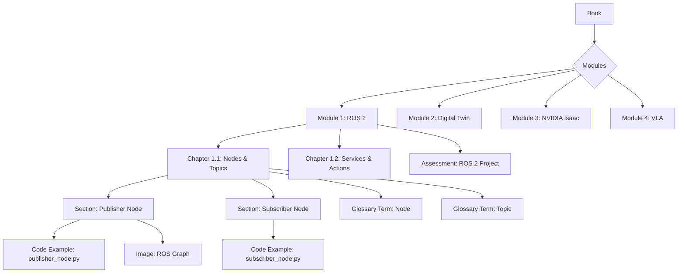

# Conceptual Data Model: Physical AI & Humanoid Robotics Technical Book

**Date**: 2025-12-05
**Feature**: [Link to spec.md]

## Purpose

This document outlines the conceptual structure and relationships of the content within the technical book. It is not a traditional software data model, but rather a guide for organizing information and ensuring consistency across chapters and code examples.

## Key Entities and Relationships

### 1. Book Module
- **Description**: A high-level organizational unit, typically corresponding to a major part of the book (e.g., "ROS 2 Fundamentals", "Digital Twin Simulation").
- **Attributes**: Title, Description, Learning Objectives.
- **Relationships**: Contains multiple Chapters.

### 2. Chapter
- **Description**: A self-contained section within a Module, focusing on a specific topic (e.g., "Nodes and Topics", "URDF Modeling").
- **Attributes**: Title, Abstract, Prerequisites, Learning Objectives, Content Body (MDX), Key Takeaways, Exercises, Further Reading.
- **Relationships**: Belongs to one Module; May reference multiple Code Examples.

### 3. Content Section
- **Description**: A sub-section within a Chapter, breaking down the topic further.
- **Attributes**: Heading, Content Body (MDX).

### 4. Code Example
- **Description**: A runnable code snippet or small project illustrating a concept.
- **Attributes**: File Path, Language, Description, Dependencies, Expected Output, Explanation.
- **Relationships**: Referenced by one or more Chapters.

### 5. Glossary Term
- **Description**: A definition for a key technical term used in the book.
- **Attributes**: Term, Definition, References.
- **Relationships**: Referenced by Content Sections and Chapters.

### 6. Image/Diagram
- **Description**: Visual aids embedded in the content.
- **Attributes**: File Path, Caption, Alt Text, Source.
- **Relationships**: Embedded in Content Sections and Chapters.

## Content Flow and Structure

## Data Model Decisions

- **MDX for Content**: All narrative and conceptual content will be written in MDX to allow for rich media and interactive components.
- **External Code Examples**: Code will be kept in a separate `code-examples/` directory and referenced, rather than embedded directly, to ensure reproducibility and independent testing.
- **Version Control**: Git will be used for versioning all content and code, with Docusaurus providing additional versioning capabilities for book editions.
